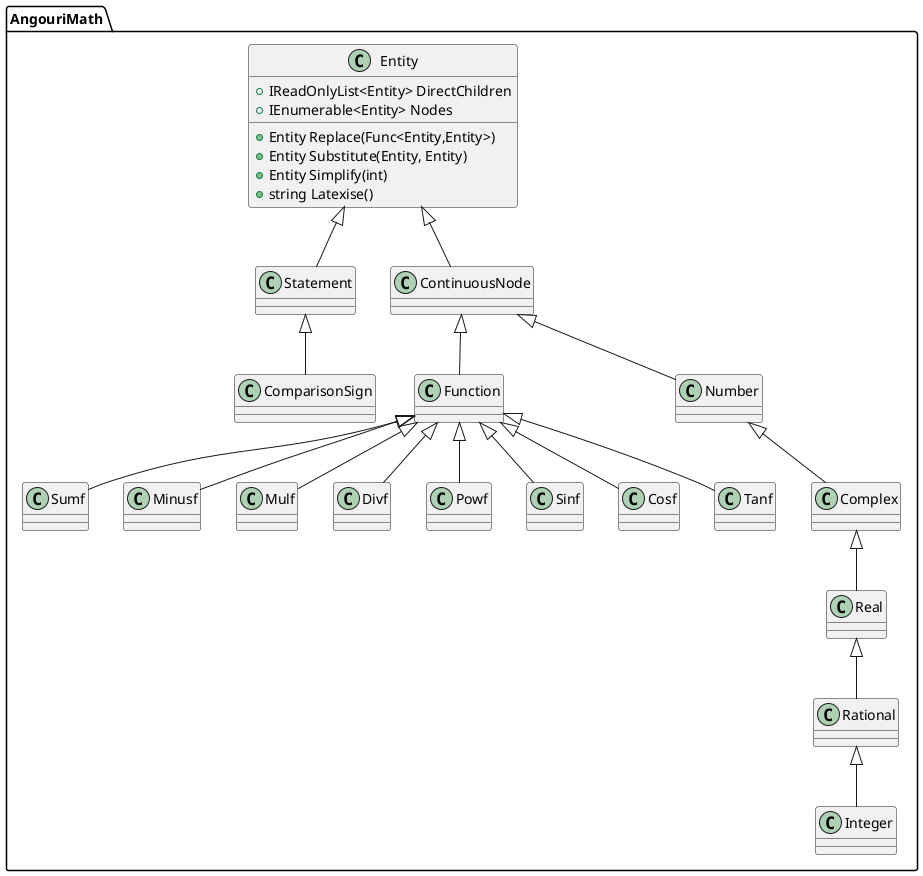

# AngouriMath Agent Guide

This repository contains the **AngouriMath** symbolic algebra project. It is organized as a .NET solution under `Sources/AngouriMath.sln` with multiple projects:

- **Sources/AngouriMath** – Core C# library implementing symbolic algebra functionality.
- **Sources/Analyzers** – Roslyn analyzers ensuring code quality across the project.
- **Sources/Wrappers** – Language wrappers including F#, Interactive, and C++ bindings.
- **Sources/Terminal** – CLI application written in F# for quick expression evaluation.
- **Sources/Tests** – Collection of unit tests covering both C# and wrappers.
- **Sources/Utils** – Utility tools used for code generation and helper scripts.

The solution file `Sources/AngouriMath.sln` aggregates these projects so they can be built together.

## Namespaces

The library heavily relies on a small set of namespaces:

- `AngouriMath` – high level API, global aliases, and the `Entity` hierarchy.
- `AngouriMath.Core` – internal infrastructure (parsing, domain handling, multithreading, etc.).
- `AngouriMath.Functions` – algorithms (simplification, evaluation, algebra, tree utilities).
- `AngouriMath.Convenience` – extension helpers and the `MathS` class.

`GlobalUsings.cs` defines common namespaces so that most source files omit explicit `using` statements.

Entities are defined via nested `partial record` types inside `Entity`. Continuous expressions derive from `Entity.ContinuousNode` while boolean expressions derive from `Entity.Statement`. Numbers form their own branch: `Entity.Number → Complex → Real → Rational → Integer`. Operators and functions are declared as records such as `Entity.Sumf` or `Entity.Sin`.

## Tests and Lint

- Tests can be executed with `dotnet test Sources/AngouriMath.sln`.
- Formatting follows `.editorconfig`; `dotnet format` may be run for linting.

## Class Diagram

Below is a simplified overview of the main classes. Only key relationships are shown.



This UML diagram illustrates the central `Entity` type with its main descendants and several function nodes. The library defines many more nodes following the same pattern.

## Build Instructions

AngouriMath uses the .NET SDK. To restore dependencies and build all projects, run:

```bash
 dotnet build Sources/AngouriMath.sln
```

To format the code according to the project's `.editorconfig` rules:

```bash
 dotnet format
```

## Running Tests

The test suite can be executed with:

```bash
 dotnet test Sources/AngouriMath.sln
```

This runs unit tests for the core library as well as wrapper projects.

## Contributing

1. Fork the repository and create your feature branch.
2. Commit changes with clear messages in English.
3. Run `dotnet format` and `dotnet test` before opening a pull request.
4. Ensure new functionality includes unit tests where applicable.

For detailed contribution guidelines, see `CONTRIBUTING.md` in the repository root.

## Additional Resources

- [Project Website](https://am.angouri.org)
- [Quickstart Guide](https://am.angouri.org/quickstart/)
- [Wiki](https://am.angouri.org/wiki/)