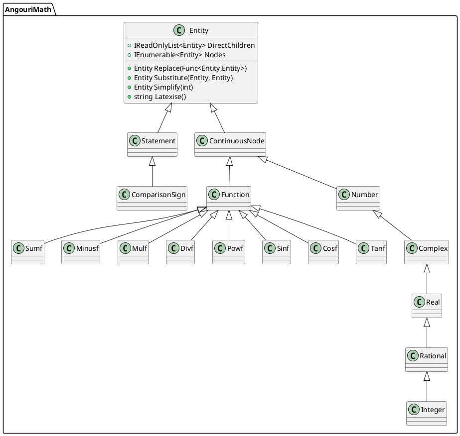

# AngouriMath Agent Guide

This repository contains the **AngouriMath** symbolic algebra project. It is organized as a .NET solution under `Sources/AngouriMath.sln` with multiple projects:

- **AngouriMath** – the main C# library located in `Sources/AngouriMath/AngouriMath`.
- **Analyzers** – Roslyn analyzers for the project (`Sources/Analyzers`).
- **Wrappers** – language wrappers (F#, Interactive, C++, etc.) in `Sources/Wrappers`.
- **Terminal** – a CLI application written in F# under `Sources/Terminal`.
- **Tests** – unit tests and wrapper tests under `Sources/Tests`.
- **Utils** – helper tools used for code generation (`Sources/Utils`).

## Namespaces

The library heavily relies on a small set of namespaces:

- `AngouriMath` – high level API, global aliases, and the `Entity` hierarchy.
- `AngouriMath.Core` – internal infrastructure (parsing, domain handling, multithreading, etc.).
- `AngouriMath.Functions` – algorithms (simplification, evaluation, algebra, tree utilities).
- `AngouriMath.Convenience` – extension helpers and the `MathS` class.

`GlobalUsings.cs` defines common namespaces so that most source files omit explicit `using` statements.

Entities are defined via nested `partial record` types inside `Entity`. Continuous expressions derive from `Entity.ContinuousNode` while boolean expressions derive from `Entity.Statement`. Numbers form their own branch: `Entity.Number → Complex → Real → Rational → Integer`. Operators and functions are declared as records such as `Entity.Sumf` or `Entity.Sin`.

## Tests and Lint

- Tests can be executed with `dotnet test Sources/AngouriMath.sln`.
- Formatting follows `.editorconfig`; `dotnet format` may be run for linting.

## Class Diagram

Below is a simplified overview of the main classes. Only key relationships are shown.

This UML diagram illustrates the central `Entity` type with its main descendants and several function nodes. The library defines many more nodes following the same pattern.

